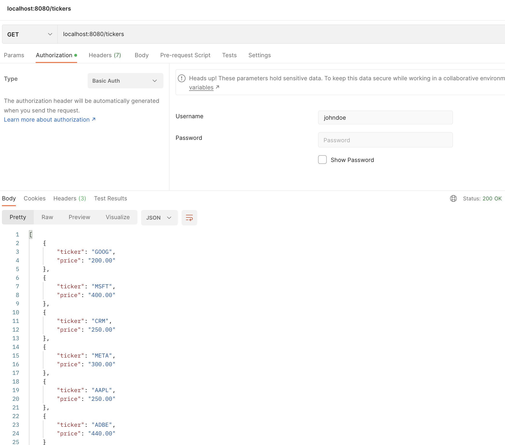
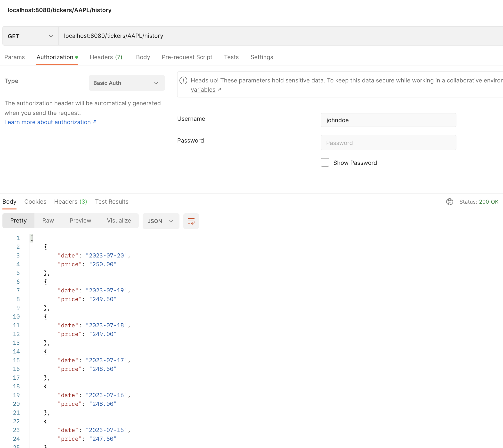
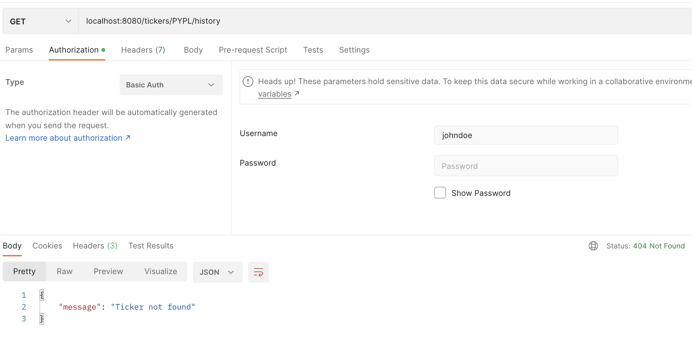
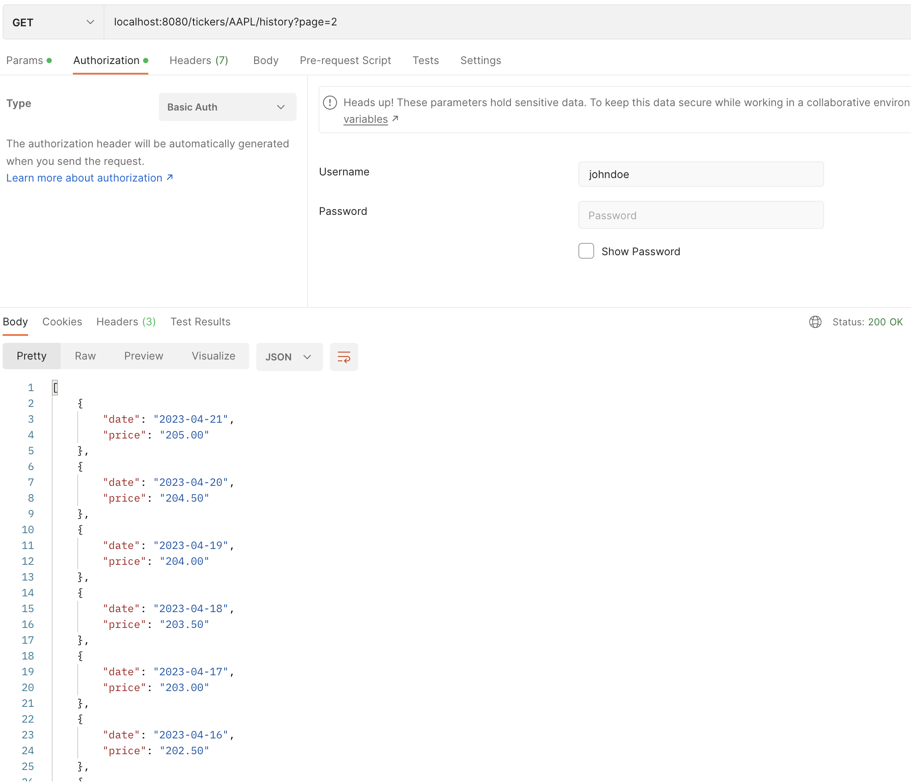

# Superlayer – Exercise

This repository is an implementation of the test assessment for Superlayer. The service is a small HTTP API for a fictitious brokerage service called LittleJohn

### API documentation

The service includes two endpoints as per the requirements: 
1. `GET /tickers`: returns the user portfolio with entries containing ticker name and current price  
2. `GET /tickers/<ticker_name>/history?page=N`: returns the price history for ticker, as long as it is present in user's portfolio. Otherwise, status code 404 is returned. The history can be paged, with up to 10 years of history and 90 days per page. 

The API is protected with HTTP Basic Authentication, where login is the username and password is empty. 

### Data source 
According to the requirements, no persistence solution was supposed to be used, yet the price history should have been consistent over restarts. To the best of my knowledge, this can be implemented in two possible ways: 

A) Test entries for portfolio and prices are generated every time in a deterministic way, so that the same values would be returned with two requests separated by service restart, or

B) The data would be loaded from an external service - for example, Yahoo finance, coupled by an external user auth / SSO service. 

Given the limitations of this test task, I chose to use the approach A). Few base prices (which approximately match corresponding average stock prices seen over time), permitted ticker names, and few test usernames ended up having to be hardcoded, while the actual user portfolio and price history are generated in the following way: 

- User portfolio is generated based on username symbols. Each next entry in the portfolio is taken as the index in the slice of mocked tickers, where the index is calculated as remainder of the division of the next username symbol ASCII order by the ticker slice length (with avoiding there repetition on repetitive symbols).  
- Price history is generated as a steady daily price increment (decrement) of 0.5, where the hardcoded base price is considered to be on Jan 01, 2023. The algorithm doesn't consider weekends and bank holidays for simplicity. 

### Instructions to run the project
Prerequisites: 
- A box with make and docker.
- Port 8080 will get exposed, so it needs to be available.

Build the project: 

`make build`

This will build the docker container with the app, and also the integration tests (compiled into a binary). It will also run the unit tests as part of the docker build. 

`make run`

This will run the app in docker container and expose HTTP API on port 8080. The container will be run as a daemon.

`make integration-tests`

Will run integration tests off the binary wired into the container.

`make stop`

Stop and delete the docker container.

### Testing

The unit and integration tests cover only a subset of use cases, due to the limitations of a test project. 

Apart from that, manual testing was done against the API using Postman. On the images below, the user `johndoe` is used for authentication, with empty password. 

User's portfolio: 

History, default (first) page, starting with today's date - Jul 20th, 2023: 

In case if user doesn't have a certain stock in their portfolio, 404 Not Found error returned: 

History, second page: 

